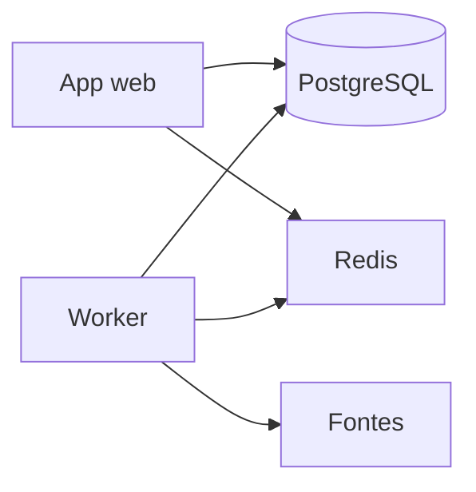
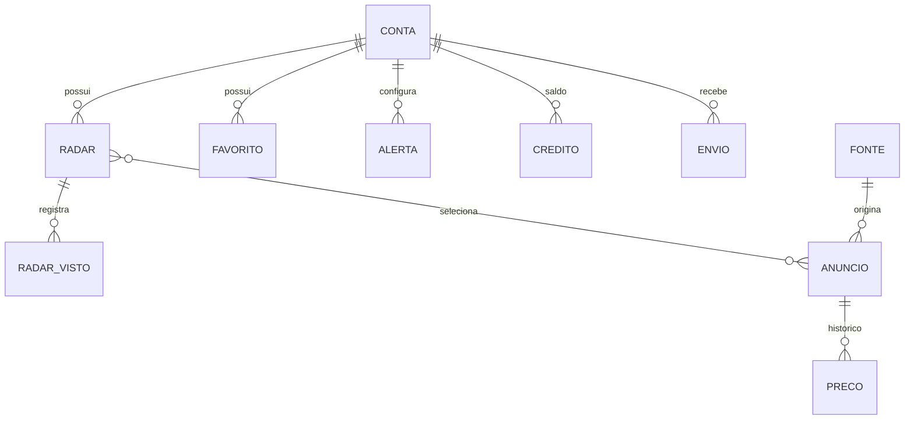

# Architecture Spine — rondimob

## Design Paradigm

Monólito modular com worker isolado. O app web atende o portal público e a área do cliente. A coleta e o e-mail rodam num processo à parte. O banco é um só: anúncios compartilhados, dados da conta sob row-level security.

## Invariants & Rules



O app web não coleta anúncio dentro do request. O worker não renderiza página.

### AD-1 — Corpus compartilhado e RLS nas tabelas privadas [ADOPTED]

- **Binds:** FR-3, FR-6, FR-7, FR-11
- **Prevents:** um módulo gravar anúncio com dono de conta, e outro isolar saldo ou visto só com filtro no ORM
- **Rule:** Anúncio não tem dono de conta. Estas relações usam `ENABLE` e `FORCE ROW LEVEL SECURITY`: dados da conta, radar, favorito, alerta, crédito, visto do radar e registro de envio. O papel da web e o papel do worker não são superuser, não são donos dessas tabelas e não têm `BYPASSRLS`.

### AD-2 — Contexto da conta dentro da transação [ADOPTED]

- **Binds:** FR-3, todo acesso a tabela privada
- **Prevents:** `SET` de sessão vazar entre contas num pooler em modo transação
- **Rule:** Dentro da transação, antes das queries privadas, o código chama `set_config('app.conta_id', ..., true)`. Toda policy lê `app.conta_id`. O valor morre com a transação. O worker que cruza contas lê os identificadores e abre uma transação por conta. Não há papel com `BYPASSRLS`.

### AD-3 — Uma fila por fonte, fora do processo web [ADOPTED]

- **Binds:** FR-6
- **Prevents:** a falha ou a fila de uma fonte parar o site ou as outras fontes
- **Rule:** O worker é outro processo. Cada fonte tem a própria fila. As primeiras fontes são ZAP Imóveis, Viva Real e OLX. Erro de uma fonte fica registrado e não cancela as outras.

### AD-4 — Sem schema por tenant no primeiro dia [ADOPTED]

- **Binds:** FR-3
- **Prevents:** adotar django-tenants como padrão inicial
- **Rule:** Um schema. django-tenants não entra nesta versão.

### AD-5 — Um app, duas formas de conta, as mesmas funções [ADOPTED]

- **Binds:** FR-1, FR-2, FR-8
- **Prevents:** um portal para corretor e outro para imobiliária, ou duas áreas de cliente
- **Rule:** Portal público e área do cliente são o mesmo app. Conta de corretor com CRECI e conta de imobiliária pessoa jurídica autorizam as mesmas funções. O que muda é o cadastro.

### AD-6 — Coleta e e-mail fora do request [ADOPTED]

- **Binds:** FR-6, FR-10
- **Prevents:** enviar e-mail ou raspar página dentro do request HTTP
- **Rule:** Coleta e envio de e-mail são tarefas do worker.

### AD-7 — Cota no plano, crédito na conta [ADOPTED]

- **Binds:** FR-4, FR-11
- **Prevents:** um módulo mudar o plano para vender mais pesquisas, ou debitar a coleta compartilhada na conta
- **Rule:** As funções de monitoramento são as mesmas em todo plano pago. A diferença é a cota. Grátis: 10 pesquisas em 14 dias a partir da criação da conta, sem compra de crédito. Padrão: 30 por mês-calendário, R$ 97. Plus: 100 por mês-calendário, R$ 197. O mês e os 14 dias usam `America/Sao_Paulo`. A cota não acumula. Pacote: 10 pesquisas, R$ 47, somado ao saldo, sem mudar o plano, gasto depois da cota, sem vencimento nesta versão. Só `contas` altera cota e saldo. Uma pesquisa é uma execução de um radar da conta contra o corpus já gravado. Criar ou editar radar não gasta. Abrir resultado já gravado não gasta. A coleta não gasta. Recarregar é comprar o pacote no request web, não é rodar de novo de graça. Sem plano, a conta vê o nome dos radares e os planos, e não executa pesquisa, não favorita e não configura alerta. Com plano e cota esgotada, vê resultados já gravados, não executa pesquisa e pode comprar crédito.

### AD-8 — Um dono e uma identidade para o anúncio [ADOPTED]

- **Binds:** FR-6, FR-7
- **Prevents:** `coleta` e `anuncios` gravarem o mesmo imóvel com chaves diferentes
- **Rule:** `anuncios` é o dono de `Anúncio` e `Preço`. `coleta` entrega o payload e não declara esses modelos. A chave única é fonte mais identificador externo quando ele é confiável. Sem isso, a chave é a URL. Uma coleta que repete o preço atual só atualiza o instante da coleta. Uma linha de `Preço` nasce quando o `numeric` muda. Favorito aponta para a chave primária desse anúncio.

### AD-9 — O visto do radar nasce na pesquisa [ADOPTED]

- **Binds:** FR-7, FR-8
- **Prevents:** o worker marcar “novo” na coleta e a web calcular “novo” noutro lugar
- **Rule:** `RadarVisto` guarda radar, anúncio, fato e instante. Pertence a `radares`, é privado e está na lista do AD-1. Só é escrito dentro de uma pesquisa que `contas` já aceitou. A coleta para no corpus.

### AD-10 — Alerta é configuração, envio é outro registro [ADOPTED]

- **Binds:** FR-10
- **Prevents:** o worker gravar o alerta da conta, ou a web gravar o que já foi enviado
- **Rule:** `Alerta` é a configuração, dono `radares`, escrita só na área autenticada. `Envio` é o livro do que saiu, dono `coleta`, escrito só pelo worker, privado, na lista do AD-1. A chave impede o mesmo anúncio e o mesmo fato mais de uma vez na janela da frequência escolhida.

### AD-11 — Contrato das colunas do anúncio [ADOPTED]

- **Binds:** FR-5, FR-6
- **Prevents:** a coleta guardar área como texto e o radar comparar área como número
- **Rule:** `anuncios` define as colunas e só o upsert do worker as grava. Preço e área são `numeric`, área em m². Quartos, banheiros e vagas são inteiros. Cidade, bairro, tipo e imobiliária anunciante são texto já normalizado. O filtro do radar só compara esse contrato.

### AD-12 — Operação mínima [ADOPTED]

- **Binds:** all
- **Prevents:** um épico migrar no boot e outro migrar à mão, ou cada um escolher um destino de log
- **Rule:** A migração entra antes de a web e o worker novos atenderem. O backup é um dump do único Postgres. O log é a saída padrão dos dois processos. O worker é um processo supervisionado, separado da web. O hospedeiro continua em aberto.

### AD-13 — Sem gateway de pagamento nesta espinha [ADOPTED]

- **Binds:** FR-4, FR-11
- **Prevents:** um épico cobrar no Mercado Pago e outro no Stripe
- **Rule:** Nenhum módulo integra um gateway. Ativar plano e somar crédito são mudança de estado em `contas`. Um gateway só entra quando um AD posterior o nomear.

## Consistency Conventions

| Concern | Convention |
| --- | --- |
| Naming (entities, files, interfaces, events) | Entidades do glossário do PRD: Conta, Radar, Anúncio, Alerta, Favorito, Fonte. Alerta é a configuração do e-mail, não uma tabela paralela de mensagem. |
| Data & formats (ids, dates, error shapes, envelopes) | Preço é `numeric`. Identificador exposto de conta, radar, favorito e crédito é UUID. Instante de coleta é `timestamptz` em UTC. Saldo de crédito é inteiro. |
| State & cross-cutting (mutation, errors, logging, config, auth) | Mutação de anúncio e de histórico de preço só no worker. Mutação de radar, favorito e alerta só na área autenticada, sob a conta da transação. Sessão vale até o logout e só para aquela conta. |

## Stack

Versões lidas em 2026-09-23.

| Name | Version |
| --- | --- |
| Python | 3.13.15 |
| Django | 6.1.1 |
| PostgreSQL | 18.6 |
| Celery | 5.6.3 |
| Redis | 8.10.2 |

## Structural Seed



Anúncio e preço não apontam para conta. Radar, favorito e alerta apontam.

```text
rondimob/
  config/       # settings, uma entrada web e uma entrada worker
  contas/       # cadastro, sessão, planos, saldo de crédito
  anuncios/     # corpus compartilhado e histórico de preço
  radares/      # radar, favorito, alerta
  coleta/       # tarefa por fonte
```

Os nomes das pastas são o seed. O limite de cada pasta permanece este.

Dois processos no mesmo código: web e worker. Um PostgreSQL. Um Redis. Ambiente local e um ambiente de produção. O hospedeiro não está escolhido.

## Capability → Architecture Map

| Capability / Area | Lives in | Governed by |
| --- | --- | --- |
| FR-1 Portal público | contas, templates do app web | AD-5 |
| FR-2 Conta e sessão | contas | AD-2, AD-5 |
| FR-3 Isolamento | PostgreSQL, todas as queries privadas | AD-1, AD-2, AD-4 |
| FR-4 Planos, cota e bloqueio | contas | AD-7 |
| FR-11 Créditos | contas | AD-7 |
| FR-5 Radar | radares | AD-1, AD-2 |
| FR-6 Coleta e normalização | coleta, worker | AD-3, AD-6 |
| FR-7 Novo e preço | anuncios, escrito na pesquisa | AD-8, AD-9 |
| FR-8 Área do cliente | app web | AD-5, AD-9 |
| FR-9 Favorito | radares | AD-1, AD-2, AD-8 |
| FR-10 E-mail | coleta, worker | AD-6, AD-10 |

## Deferred

- Toolkit de tela e paleta. A direção visual está no PRD. A biblioteca de interface ficou aberta na pesquisa.
- Hospedeiro e região do deploy. O mínimo de operação está no AD-12.
- Provedor de pagamento. O AD-13 proíbe integrar um gateway até outro AD nomeá-lo.
- Fornecedor de e-mail.
- RAG, fine tuning, WhatsApp, score e aplicativo.
